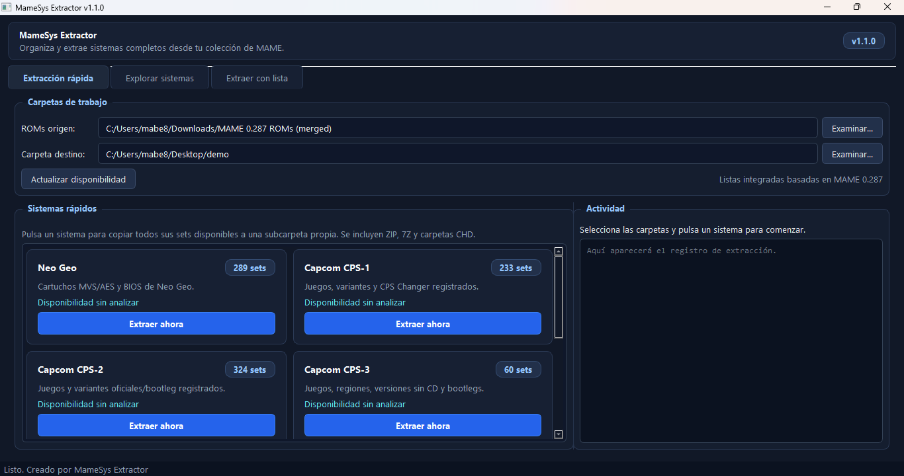
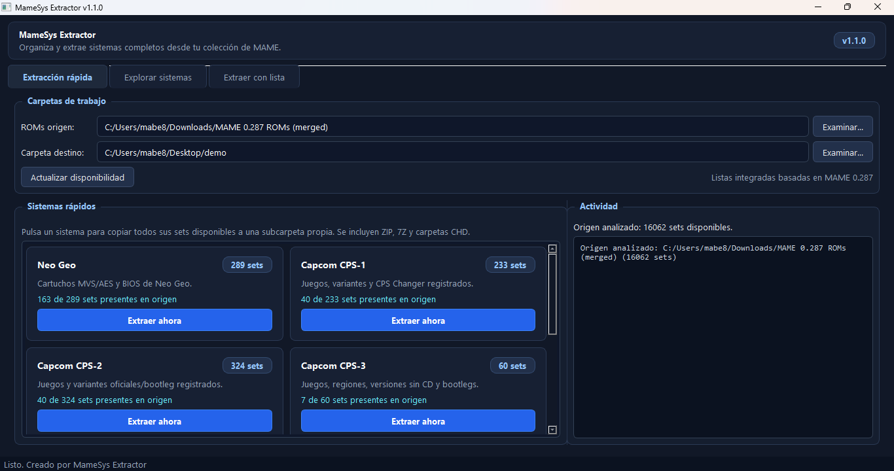
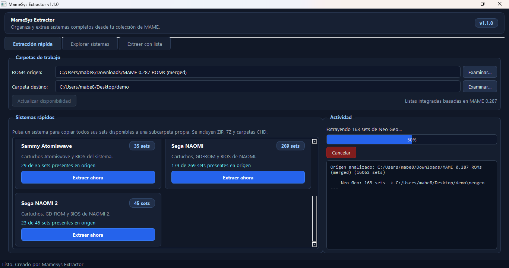
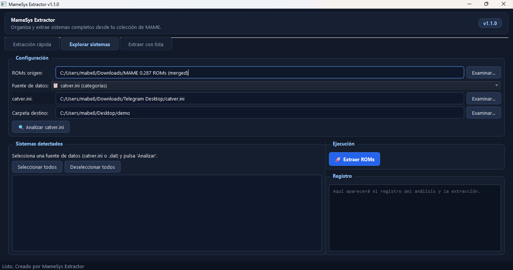
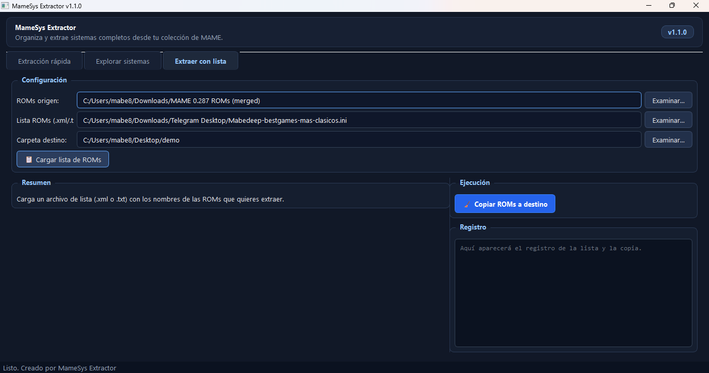
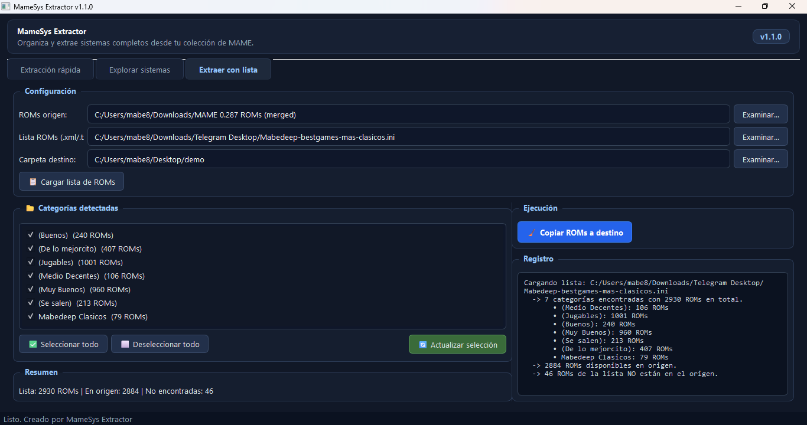
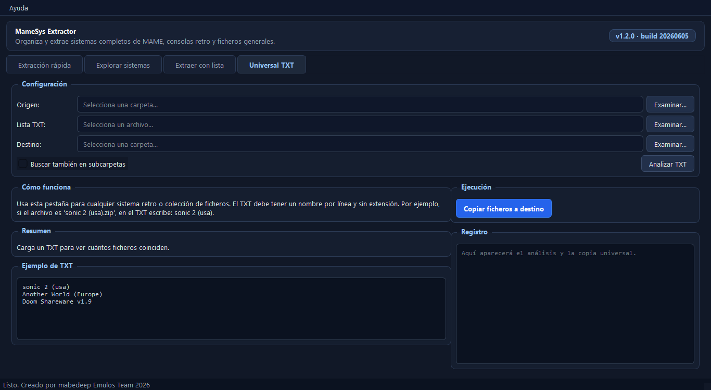

# MameSys Extractor

Aplicación de escritorio para organizar y extraer sistemas completos desde una
colección de ROMs de MAME.

MameSys Extractor permite copiar rápidamente sistemas como **Neo Geo, CPS-1,
CPS-2, CPS-3, Atomiswave, NAOMI y NAOMI 2**, explorar categorías mediante
`catver.ini` o archivos DAT, extraer selecciones personalizadas desde listas
XML, TXT o INI, y copiar ficheros de cualquier sistema retro usando una lista
TXT con nombres sin extensión.



## Características

- Extracción rápida mediante listas de sistemas integradas.
- Listas rápidas basadas en los drivers oficiales de **MAME 0.287**.
- Compatibilidad con ROMs comprimidas en `.zip` y `.7z`.
- Copia de carpetas y archivos `.chd` asociados.
- Exploración de géneros y categorías desde `catver.ini`.
- Carga de sistemas desde archivos DAT de clrmamepro.
- Extracción mediante listas personalizadas `.xml`, `.txt`, `.ini`, `.dat` o
  `.cfg`.
- Pestaña universal para consolas retro, PC retro y ficheros generales.
- Selección individual de categorías incluidas en archivos INI.
- Registro de actividad, barra de progreso y cancelación de operaciones.
- Exportación de la lista de ROMs no encontradas.
- Interfaz oscura y carpetas sincronizadas entre pestañas.

## Sistemas de extracción rápida

| Sistema | Contenido de la lista integrada |
| --- | ---: |
| Neo Geo | 289 sets |
| Capcom CPS-1 | 233 sets |
| Capcom CPS-2 | 324 sets |
| Capcom CPS-3 | 60 sets |
| Sammy Atomiswave | 35 sets |
| Sega NAOMI | 269 sets |
| Sega NAOMI 2 | 45 sets |

Las listas incluyen padres, clones, variantes y BIOS registrados por MAME.
La aplicación solo copia los sets que encuentre en la carpeta de origen.

## Capturas

### Análisis de sistemas disponibles



### Extracción en progreso



### Explorador mediante catver.ini o DAT



### Extracción con listas personalizadas



### Selección de categorías detectadas



### Copia universal por TXT



## Guía de uso

### 1. Extracción rápida

Esta es la opción recomendada para copiar un sistema completo con pocos pasos.

1. Abre la pestaña **Extracción rápida**.
2. Selecciona la carpeta que contiene tus ROMs de MAME.
3. Selecciona una carpeta de destino.
4. Pulsa **Actualizar disponibilidad** para comprobar qué sets están presentes.
5. Pulsa **Extraer ahora** en Neo Geo, CPS, Atomiswave, NAOMI o NAOMI 2.
6. Espera a que termine la copia. Cada sistema se guardará en su propia
   subcarpeta dentro del destino seleccionado.

La aplicación copiará los archivos `.zip`, `.7z` y las carpetas CHD disponibles.

### 2. Explorar sistemas con catver.ini

Esta opción permite extraer ROMs por géneros y categorías.

1. Abre la pestaña **Explorar sistemas**.
2. Selecciona la carpeta de ROMs origen y la carpeta destino.
3. Elige **catver.ini (categorías)** como fuente de datos.
4. Selecciona tu archivo `catver.ini`.
5. Pulsa **Analizar catver.ini**.
6. Marca las categorías o subcategorías que quieras copiar.
7. Pulsa **Extraer ROMs**.

> `catver.ini` clasifica principalmente por género. Para sistemas de hardware
> concretos es más precisa la pestaña **Extracción rápida**.

### 3. Explorar sistemas mediante archivos DAT

1. Abre la pestaña **Explorar sistemas**.
2. Cambia la fuente de datos a **Archivos .DAT (clrmamepro)**.
3. Selecciona la carpeta que contiene los archivos DAT.
4. Pulsa **Analizar archivos .DAT**.
5. Marca los sistemas deseados y pulsa **Extraer ROMs**.

Cada archivo DAT válido se mostrará como un sistema seleccionable.

### 4. Extraer ROMs usando una lista personalizada

1. Abre la pestaña **Extraer con lista**.
2. Selecciona la carpeta de ROMs origen.
3. Selecciona una lista `.xml`, `.txt`, `.ini`, `.dat` o `.cfg`.
4. Selecciona la carpeta destino.
5. Pulsa **Cargar lista de ROMs**.
6. Si se detectan categorías, marca únicamente las que quieras conservar y
   pulsa **Actualizar selección**.
7. Pulsa **Copiar ROMs a destino**.

Las listas de texto pueden contener un nombre de ROM por línea, con o sin la
extensión `.zip` o `.7z`.

### 5. Copiar cualquier sistema con Universal TXT

Esta pestaña sirve para consolas retro, ordenadores clásicos, PC retro o
cualquier carpeta con ficheros generales.

1. Abre la pestaña **Universal TXT**.
2. Selecciona la carpeta origen donde están los archivos.
3. Selecciona un archivo `.txt` con un nombre por línea.
4. Selecciona la carpeta destino.
5. Opcionalmente marca **Buscar también en subcarpetas**.
6. Pulsa **Analizar TXT**.
7. Pulsa **Copiar ficheros a destino**.

El TXT debe usar el nombre base del archivo, sin extensión. Ejemplo:

```text
sonic 2 (usa)
Another World (Europe)
Doom Shareware v1.9
```

Si en la carpeta origen existe `sonic 2 (usa).zip`, la aplicación lo copiará al
destino aunque en el TXT no aparezca `.zip`. También funciona con otras
extensiones como `.7z`, `.bin`, `.cue`, `.iso`, `.chd`, `.nes`, `.sfc`, `.gba`,
`.exe` y, en general, cualquier archivo cuyo nombre base coincida.

## Instalación

### Ejecutable para Windows

Descarga `MameSys_Extractor.exe` desde la sección **Releases** del repositorio y
ejecútalo. No necesita instalación.

### Ejecutar desde el código fuente

Requisitos:

- Windows, Linux o macOS.
- Python 3.10 o superior.
- PySide6 6.5 o superior.

```bash
git clone <URL-DEL-REPOSITORIO>
cd MameSys_Extractor
python -m pip install -r requirements.txt
python main.py
```

### Generar el ejecutable en Windows

Instala PyInstaller y ejecuta el script incluido:

```powershell
python -m pip install pyinstaller
.\build_exe.bat
```

El ejecutable se generará en `dist/MameSys_Extractor.exe`.

## Estructura esperada de las ROMs

```text
roms/
├── mslug.zip
├── sf2.zip
├── capsnk.zip
├── juego_con_disco.zip
└── juego_con_disco/
    └── disco.chd
```

La aplicación busca los archivos y carpetas directamente dentro del directorio
de ROMs seleccionado.

## Notas importantes

- La aplicación **copia** archivos; no elimina ni modifica las ROMs originales.
- No se incluyen ROMs, BIOS, CHD, `catver.ini` ni archivos DAT.
- Debes utilizar archivos que tengas derecho a conservar y usar.
- En romsets **merged**, muchos clones están incluidos dentro del ZIP del juego
  padre. Por ello, el número de archivos encontrados puede ser menor que el
  número total de sets mostrado en una lista.
- Para obtener mejores resultados en MAME, usa listas compatibles con la
  versión de tu romset.
- En la pestaña **Universal TXT**, si varios archivos tienen el mismo nombre
  base y distinta extensión, se copiarán todas las coincidencias.

## Tecnología

- Python
- PySide6 / Qt
- PyInstaller para generar el ejecutable de Windows
